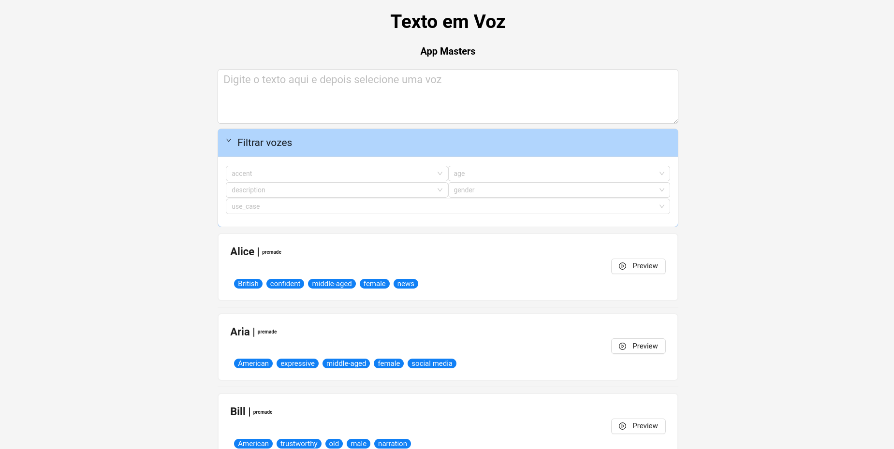

This project is a web application that converts text to speech using the ElevenLabs API. It was developed as part of the App Masters Project and leverages modern technologies, including React, TypeScript, and Ant Design.

## Functionalities

- `Text Input`: Allows users to type the text they want to convert to speech.
- `Voice Selection`: Users can choose from different voices available for conversion.
- `Voice Filtering`: Users can filter voices by category, age, gender, accent, and description.
- `Audio Playback`: Users can listen to the text-to-speech conversion directly within the application.
- `Audio Download`: Users can download the generated audio in MP3 format.

## Technologies Used

- `React`: JavaScript library for building user interfaces.
- `TypeScript`: A superset of JavaScript that adds static typing to the code.
- `Ant Design`: UI component library for React.
- `ElevenLabs API`: Service for text-to-speech conversion.
- `Vercel Blob Storage`: File storage service for enabling downloads.
- `Vercel`: Platform for deploying web applications.

Preview

  

You can find more information about the project in the `GitHub Repository`.


