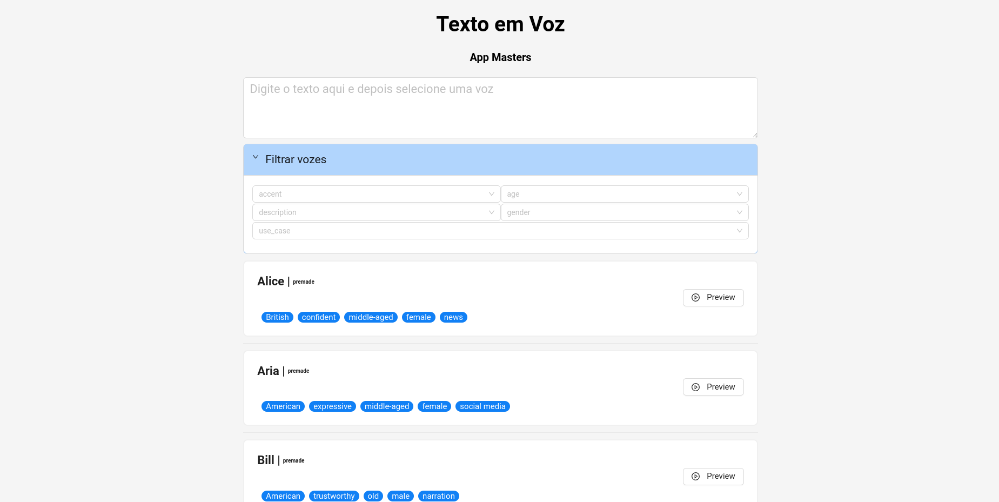

Este projeto é uma aplicação web que converte texto em fala usando a API ElevenLabs. Foi desenvolvido como parte do Projeto App Masters e utiliza tecnologias modernas, incluindo React, TypeScript e Ant Design.

## Funcionalidades

- `Entrada de Texto`: Permite que os usuários digitem o texto que desejam converter em fala.
- `Seleção de Voz`: Usuários podem escolher entre diferentes vozes disponíveis para conversão.
- `Filtragem de Voz`: Usuários podem filtrar vozes por categoria, idade, gênero, sotaque e descrição.
- `Reprodução de Áudio`: Usuários podem ouvir a conversão de texto para fala diretamente na aplicação.
- `Download de Áudio`: Usuários podem baixar o áudio gerado em formato MP3.

## Tecnologias Utilizadas

- `React`: Biblioteca JavaScript para construção de interfaces de usuário.
- `TypeScript`: Um superset do JavaScript que adiciona tipagem estática ao código.
- `Ant Design`: Biblioteca de componentes de UI para React.
- `API ElevenLabs`: Serviço para conversão de texto em fala.
- `Vercel Blob Storage`: Serviço de armazenamento de arquivos para habilitar downloads.
- `Vercel`: Plataforma para implantação de aplicações web.

Pré-visualização

  

Você pode encontrar mais informações sobre o projeto no `Repositório GitHub`.
