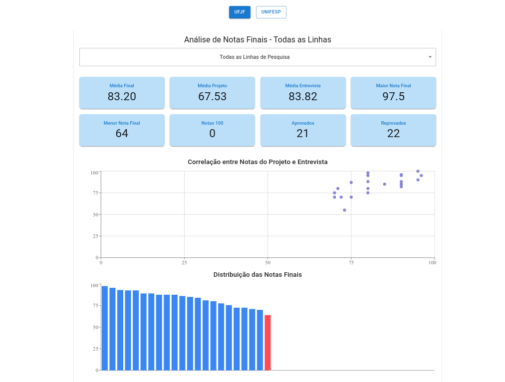

This project analyzes the admissions process for the **2024-2025 academic year** in two PhD programs. It includes two main PhD programs in History: **Federal University of Juiz de Fora (UFJF)** and **Federal University of São Paulo (Unifesp)**. Gathering data from the project analysis.

This is an exploratory project, conducted as a test and out of curiosity about the programs in question. It also aims to put into practice some data analysis techniques.

[Demo](https://processo-seletivo-2024-2025.vercel.app/)

## Functionalities

- `Graphical Analysis`: Provides a visual representation of the admissions process numbers.
- `Data Visualization`: Displays the data in a clear and concise manner.

## Technologies Used

- `JavaScript`: Programming language for web development.
- `recharts`: A charting library for React.
- `React`: JavaScript library for building user interfaces.
- `Vite`: A build tool that aims to provide a faster and leaner development experience.
- `Vercel`: Platform for deploying web applications.

Preview

  

You can find more information about the project in the `GitHub Repository`.
