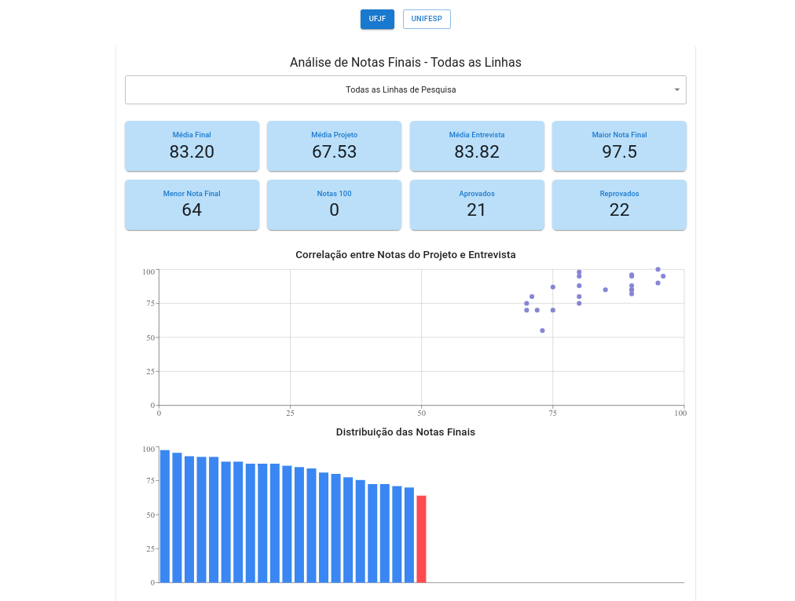

本项目分析了两个博士项目在**2024-2025 学年**的招生流程。包括历史学的两个主要博士项目：**联邦胡伊斯德福拉大学（Federal University of Juiz de Fora，UFJF）**和**圣保罗联邦大学（Federal University of São Paulo，Unifesp）**。通过项目分析收集数据。

这是一个探索性项目，作为测试并出于对相关项目的好奇心开展。同时旨在将一些数据分析技术付诸实践。

[演示](https://processo-seletivo-2024-2025.vercel.app/)

## 功能

- `图形分析`：提供招生流程数据的可视化表示。
- `数据可视化`：以清晰简洁的方式展示数据。

## 使用技术

- `JavaScript`：用于网页开发的编程语言。
- `recharts`：React 的图表库。
- `React`：用于构建用户界面的 JavaScript 库。
- `Vite`：旨在提供更快、更精简开发体验的构建工具。
- `Vercel`：用于部署 Web 应用的平台。

预览

  

有关该项目的更多信息，请参见 `GitHub 仓库`。

