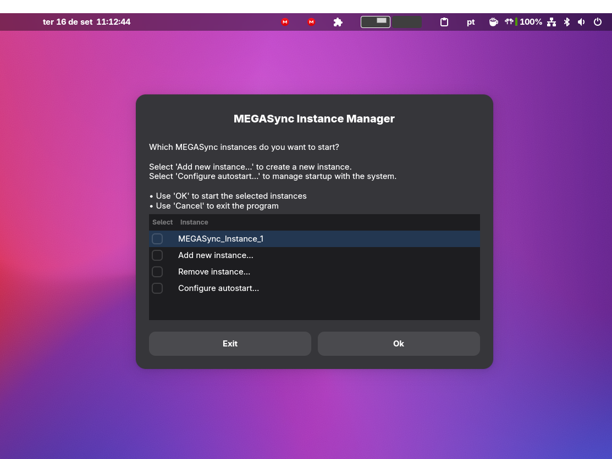

A distro-agnostic script to manage multiple MEGASync instances for different MEGA accounts.



## Features
- Works on Debian, Ubuntu, Fedora, and Arch Linux
- Graphical interface with Zenity
- Isolated instances with separate config directories
- Add instances dynamically
- Persistent instance storage



## Installation

Run this command to install:

```bash
wget -O - https://raw.githubusercontent.com/geraldohomero/megasync_multiple_instances/refs/heads/main/megasync-manager.sh | bash -s install
```

Then use:

```bash
mega
```

The script detects your distro and installs dependencies (`megasync`, `zenity`).

## Usage

- Run `mega` to open the manager.
- Select instances to start or add new ones.
- Configure auto-startup for instances.
