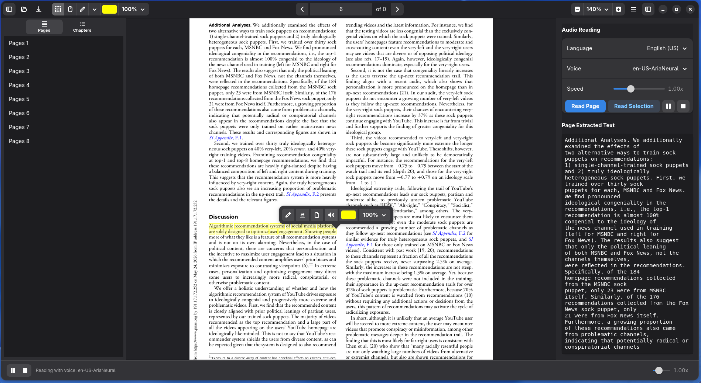

NarroPDF is a modern, minimalist, and accessible PDF reader and annotator developed in Python using the GTK4 and Libadwaita toolkit. It combines advanced document viewing, text annotation tools, and an integrated Text-to-Speech (TTS) engine with real-time synchronization.

### Key Features
* **Integrated Text-to-Speech (TTS):** Read PDFs aloud with real-time text synchronization.
* **Speed Control:** Easily adjust playback speed from 0.5x to 4.0x.
* **Annotations:** Highlight and underline text with custom colors and opacity levels. Undo support (`Ctrl+Z`).
* **Fluid Navigation:** Support for chapter sidebar, smooth drag-to-scroll, and continuous/single-page modes.
* **Keyboard Shortcuts:** Quick toggles for selection/hand modes, highlighting, underlining, and undo.
* **Modern Interface:** Responsive GNOME layout built with Libadwaita.


