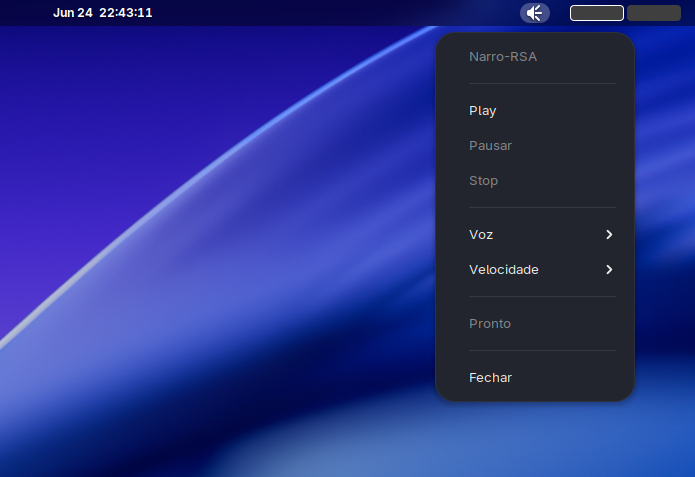

在任意应用中选择文本，使用 Ctrl+C 复制，然后按下快捷键即可唤起 TTS 播放器 —— 支持播放/暂停/停止控制、语言/语音选择以及语速调节。

### 核心功能
* **播放 / 暂停 / 停止:** 完整的播放控制栏。
* **20+ 神经语音:** 支持葡萄牙语 (BR/PT)、英语、西班牙语、法语、德语等。
* **语速调节:** 支持从 -50% 到 +100% 范围的语速调节。
* **原生 GTK 界面:** 与 GNOME 视觉风格无缝结合（支持深色模式）。
* **文本可编辑:** 在播放前可直接在框内编辑捕获的文本。
* **状态栏:** 提供实时的播放状态反馈。
* **一键隐藏 (Toggle):** 再次按下快捷键可直接关闭播放器。


