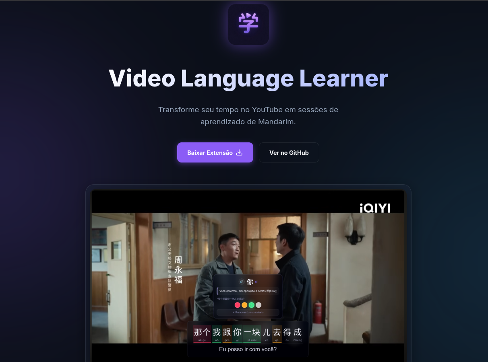



[Site](https://geraldohomero.github.io/VLL-VideoLanguageLearner/)

O Video Language Learner (VLL) é uma extensão do Google Chrome (Manifest V3) desenvolvida para ajudar estudantes de mandarim a aprender o idioma enquanto assistem a vídeos no YouTube.

> Inicialmente projetada para falantes de português (BR) aprenderem chinês (mandarim), mas pode ser adaptada para outros idiomas no futuro.

A extensão aprimora a experiência de visualização ao fornecer legendas interativas e personalizáveis que facilitam a compreensão e a retenção de novo vocabulário.

Prévia

  

