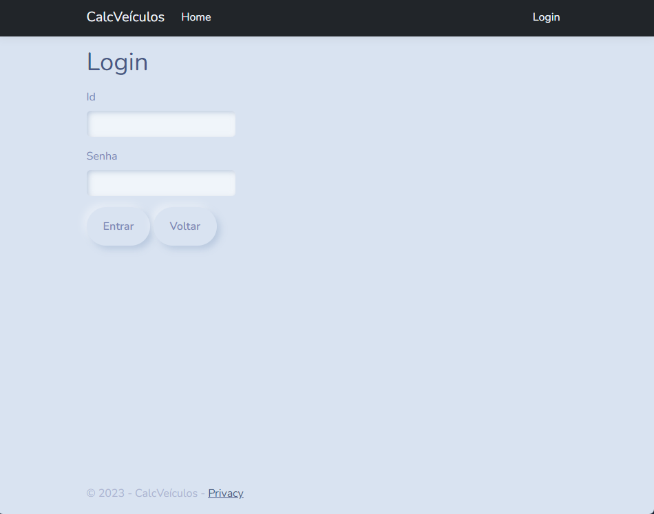

## WorstGameEver



**Tecnologias**: JavaScript, Node.js, React.js, Next.js, MySQL, DBeaver, Github, VSCode, REST

Visualizar

  

***

## PUC Minas - Mei a Mei (Eixo 4)
***2024.1***



**Tecnologias**: C#, .NET, ASP.NET Core, React.js, React Native, MongoDB, MongoDB Atlas, MongoDB Compass, RESTful API, Swagger, Postman, Visual Studio 2022, VSCode, Rider, Figma, Trello, Git, Github, NUnit, XUnit

Visualizar

  
Ainda não disponível

***

## PUC Minas - TaskBook (Eixo 3)
***2023.2***



**Tecnologias**: React Native, Expo, JavaScript, VSCode, SQLite, REST, JSON Server, MySQL

Visualizar

  

***

## CalcFlex



**Tecnologias**: JavaScript, React Native, Expo, JSON Server, VSCode, SQLite, REST

Visualizar

  

***

## PUC Minas - Desconto Universitário (Eixo 2)
***2023.1***



**Tecnologias**: HTML, CSS, Bootstrap, Tailwind, Sass, JavaScript, C#, ASP.NET Core (MVC), UML, VSCode, Visual Studio 2022, MySQL, MySQL Workbench, DBeaver, Figma

Visualizar

  

***

## Consumo de Veículos



**Tecnologias**: ASP.NET Core (MVC), C#, Visual Studio 2022, HTML, CSS, Bootstrap, EntityFramework 5.0.17, BCrypt, Microsoft SQL Server (com Data Annotations)

Visualizar

  

***

## PUC Minas - Bares e Restaurantes (Eixo 1)
***2022.2***
>Projeto destaque do semestre



- [Demo](https://icei-puc-minas-pmv-ads.github.io/pmv-ads-2022-2-e1-proj-web-t9-bares-restaurantes/)

**Tecnologias**: HTML, CSS, JavaScript, JSON, MarvelApp, Trello e VSCode

Visualizar

  

***
## Outros


 

 

 

 

 


### Websites:

 - [Janaína Di Lourenço](https://janalourenci.github.io) | Feito com [Hugo](https://gohugo.io) e [Hallo](https://github.com/EmielH/hallo-hugo/) | [Github Repo](https://github.com/janalourenci/janalourenci.github.io)

## Design

- [Pop!_OS Wallpaper](https://www.pling.com/p/1770949/)

Visualizar

  

