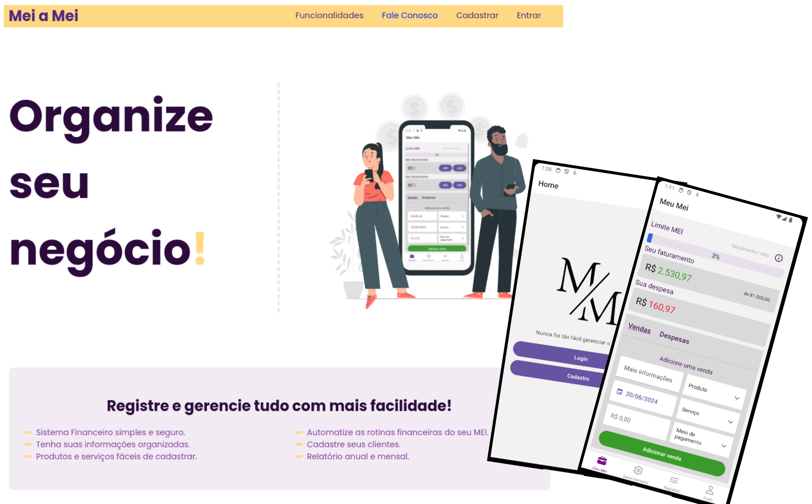
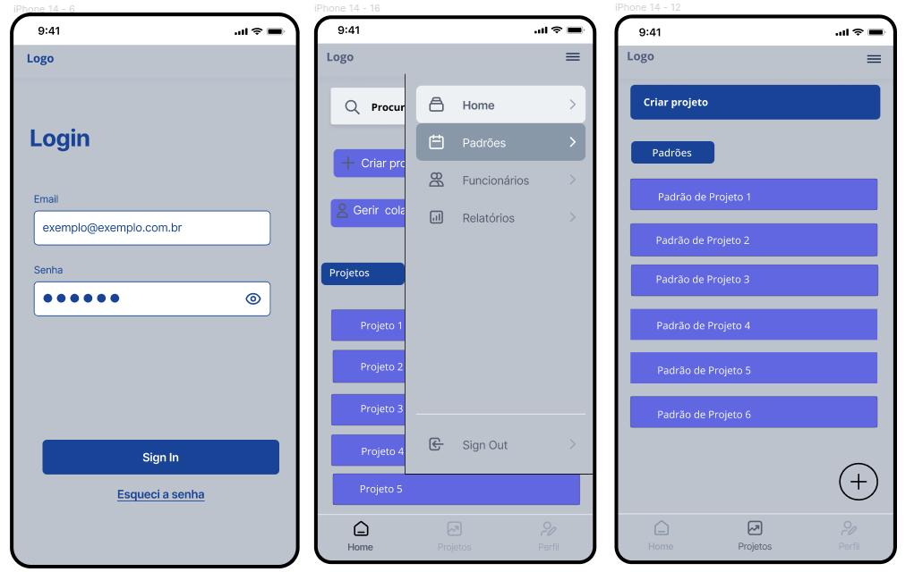
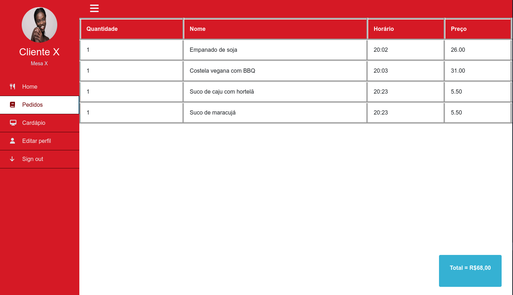

## PUC Minas

São projetos desenvolvidos durante o curso de Análise e Desenvolvimento de Sistemas na PUC Minas. Em cada semestre, os alunos são desafiados a desenvolver um projeto em grupo que aborde os conhecimentos adquiridos em cada semestre. Essa abordagem **prática** é uma forma de **consolidar o aprendizado** e preparar os alunos para o mercado de trabalho. Com isso, os alunos têm a oportunidade de desenvolver **projetos reais**, com prazos e entregas definidos, além de **trabalhar em equipe** e aprender a lidar com **desafios**.

### Mei a Mei (Eixo 4)

**Projeto Destaque** - Eixo 4

>*2024.1*





**Tecnologias**: C#, .NET, ASP.NET Core, React.js, React Native, MongoDB, MongoDB Atlas, MongoDB Compass, RESTful API, Swagger, Postman, Visual Studio 2022, VSCode, Rider, Figma, Trello, Git, Github, NUnit, XUnit

- [Demo](https://meiameipuc.azurewebsites.net/)

Visualizar

  

***

### TaskBook (Eixo 3)
*2023.2*



**Tecnologias**: React Native, Expo, JavaScript, VSCode, SQLite, REST, JSON Server, MySQL

Visualizar

  

***

### Desconto Universitário (Eixo 2)
*2023.1*



**Tecnologias**: HTML, CSS, Bootstrap, Tailwind, Sass, JavaScript, C#, ASP.NET Core (MVC), UML, VSCode, Visual Studio 2022, MySQL, MySQL Workbench, DBeaver, Figma

Visualizar

  

***

### Bares e Restaurantes (Eixo 1)

**Projeto Destaque** - Eixo 1

>*2022.2*



- [Demo](https://icei-puc-minas-pmv-ads.github.io/pmv-ads-2022-2-e1-proj-web-t9-bares-restaurantes/)

**Tecnologias**: HTML, CSS, JavaScript, JSON, MarvelApp, Trello e VSCode

Visualizar

  

***

## Projetos pessoais



 

 

 

 


### Websites

 - [Janaína Di Lourenço](https://janalourenci.github.io) | Feito com [Hugo](https://gohugo.io) e [Hallo](https://github.com/EmielH/hallo-hugo/) | [Github Repo](https://github.com/janalourenci/janalourenci.github.io)

### Design

- [Pop!_OS Wallpaper](https://www.pling.com/p/1770949/)

Visualizar

  

***


Mais projetos em breve...

