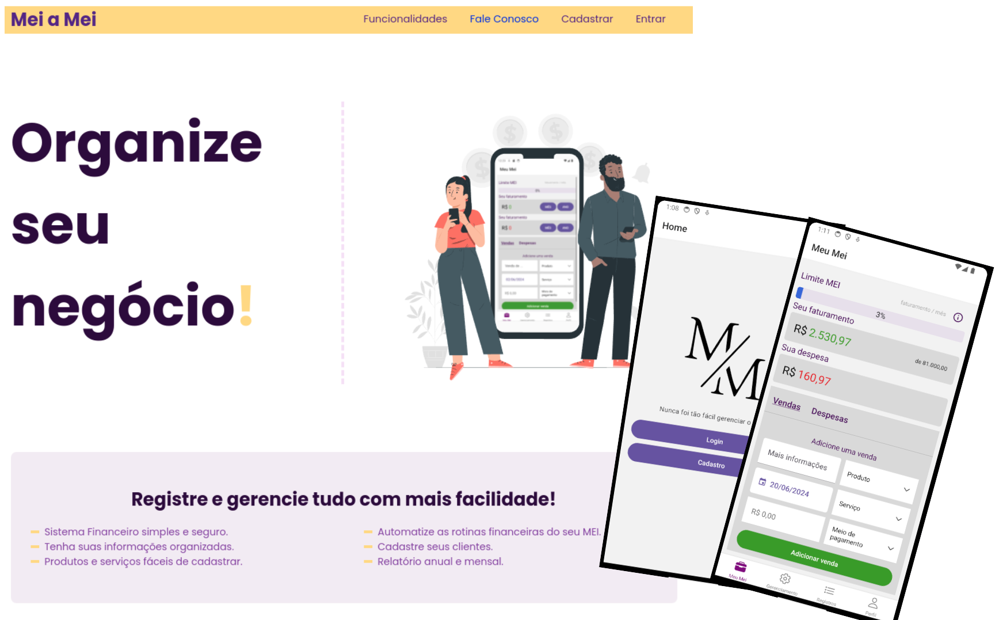
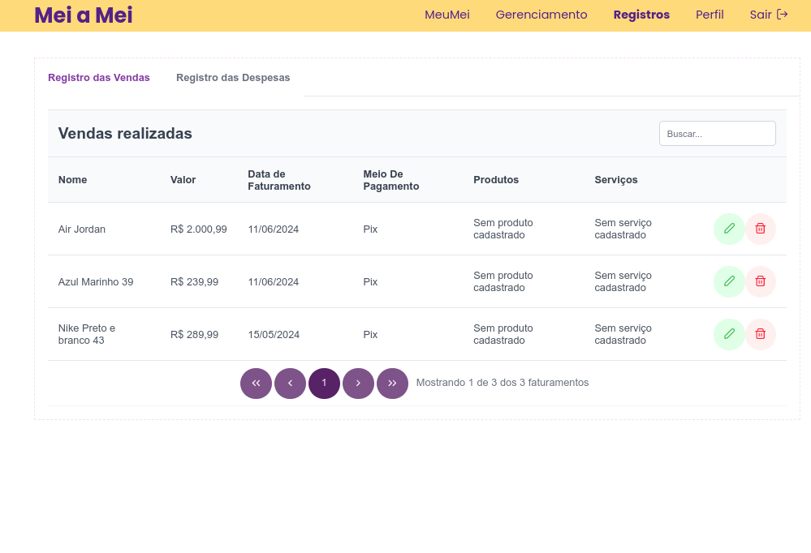
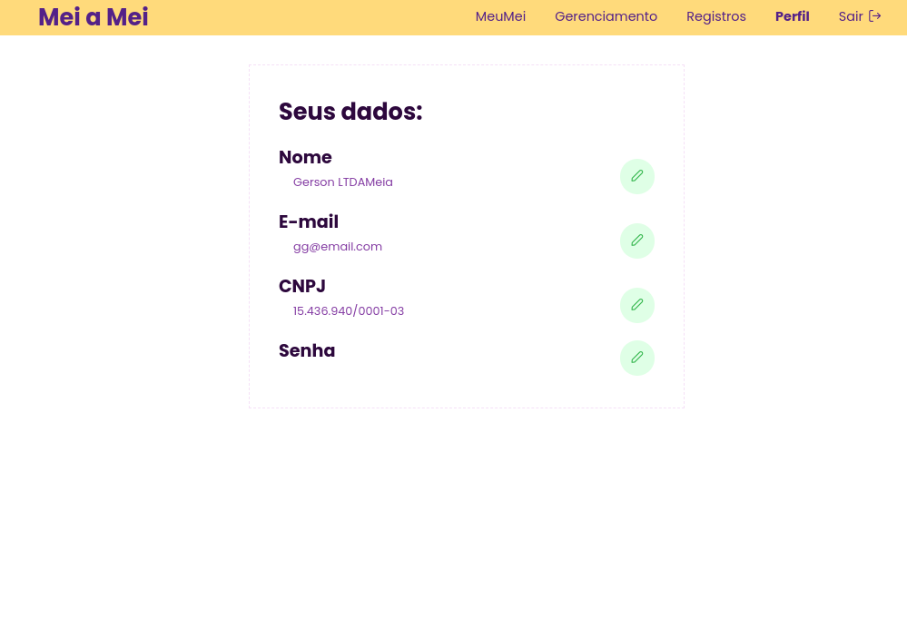
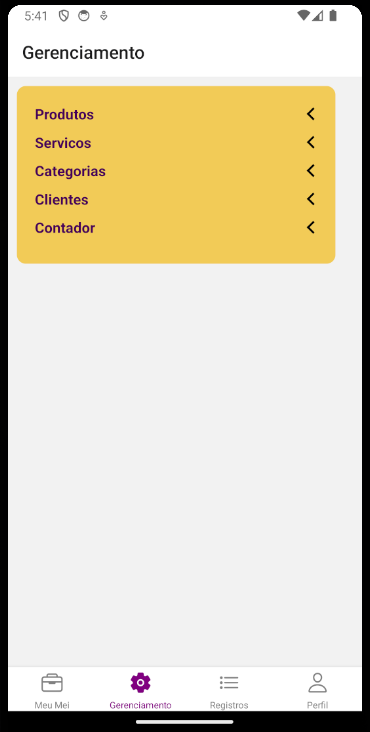

<head>
  <link rel="stylesheet" href="https://cdnjs.cloudflare.com/ajax/libs/font-awesome/6.0.0-beta3/css/all.min.css">
</head>
  

**Featured Project** - Second Year


>**First Semester of 2024**

A mobile app and web system designed to assist entrepreneurs under the MEI tax regime in managing their revenue and staying within the legal limits. The goal is to create alerts that notify the entrepreneur when they are nearing the category's revenue limit. Also, the system provides a way to manage the entrepreneur's expenses and revenue, generating reports and graphs to help them understand their financial situation.

### MEI

<button onclick="document.getElementById('meiModal').style.display='block'">
  <i class="fas fa-info-circle" title="Click for more information about MEI"></i>
</button>

Promotional Video (in Portuguese)



**Technologies**: C#, .NET, ASP.NET Core, React.js, React Native, MongoDB, MongoDB Atlas, MongoDB Compass, RESTful API, Swagger, Postman, Visual Studio 2022, VSCode, Rider, Figma, Trello, Git, Github, NUnit, XUnit

- [Website Demo](https://meiameipuc.azurewebsites.net/)

- Login: gg@email.com

- Password: 12345

> It is hosted on a free Azure server, so it may take a while to start up.

### Web System 


  
  
  
  
  
  


### Mobile App


  
  
  
  
  
  


You can find more information about the project in the `GitHub Repository`.


<!-- The Modal -->

  

    &times;
    <h2>
      <i class="fas fa-info-circle" ></i>
      What is MEI?
      </h2>
      
MEI stands for Microempreendedor Individual (Individual Microentrepreneur). It is a type of business entity in Brazil designed for small business owners who want to formalize their business activities. MEIs benefit from simplified tax obligations and reduced bureaucracy.

  

