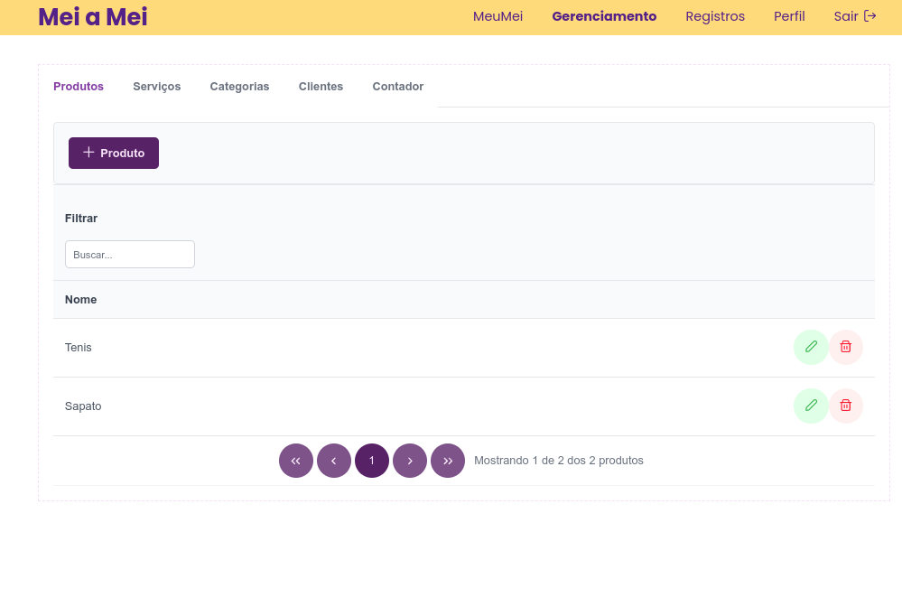
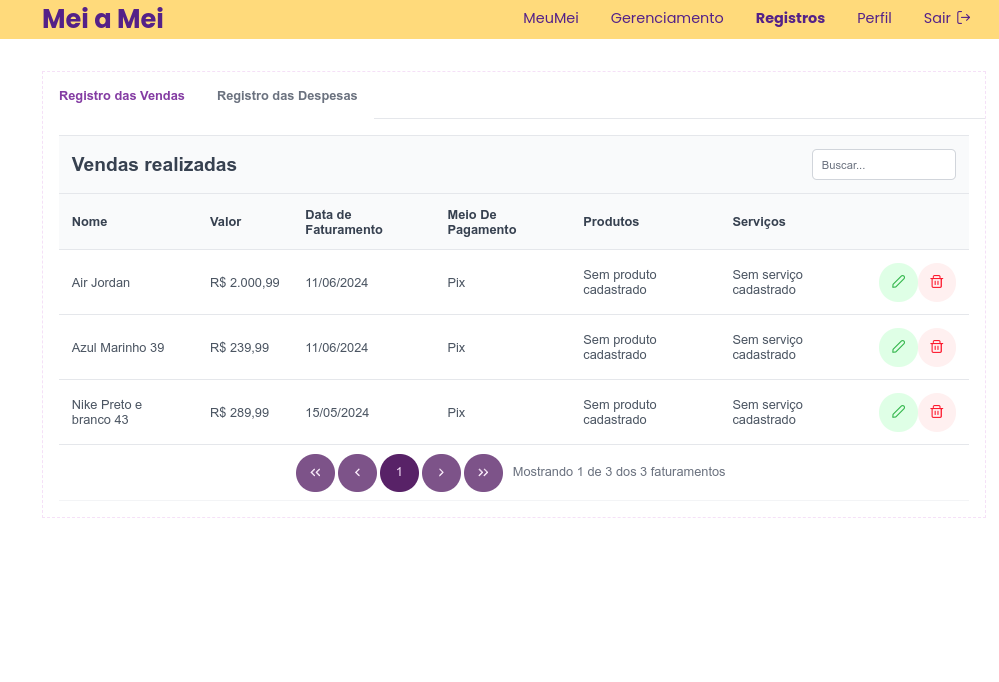
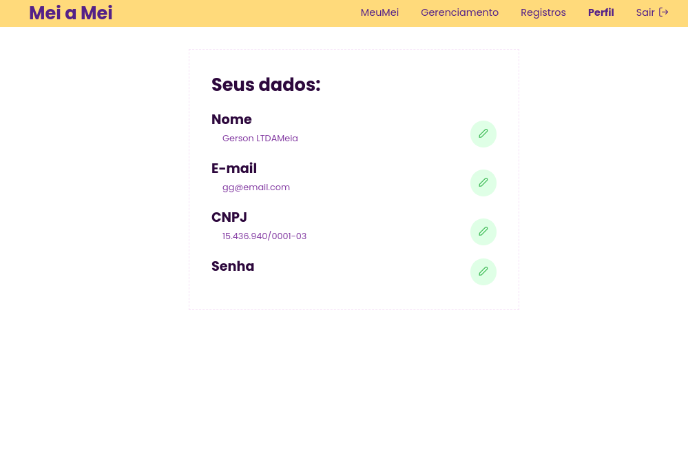
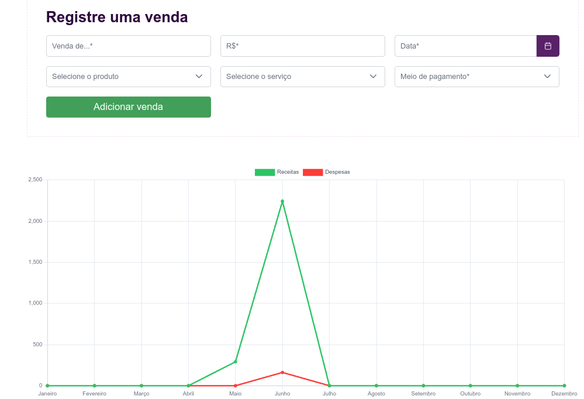
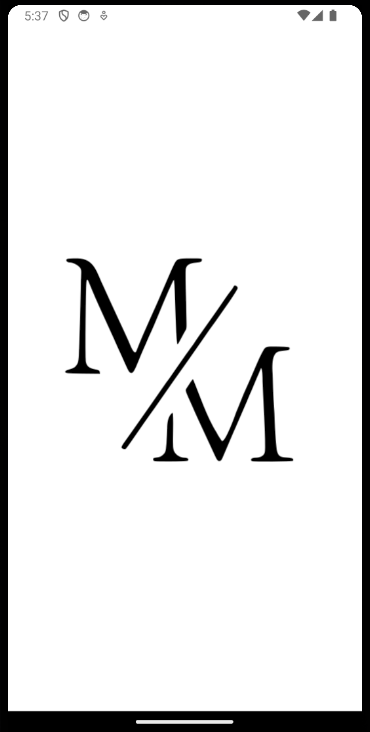
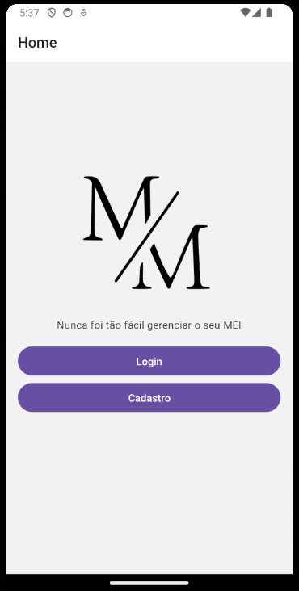
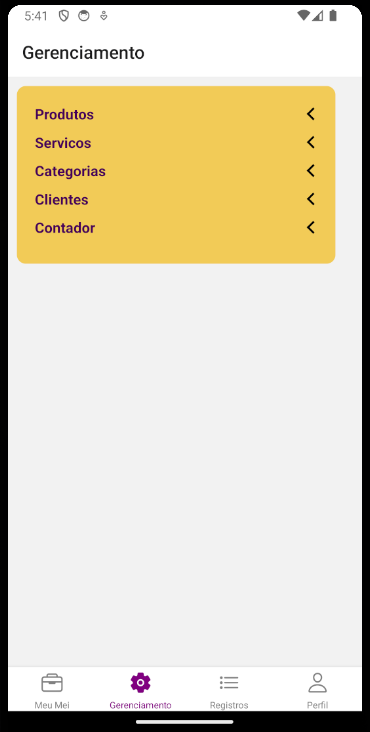
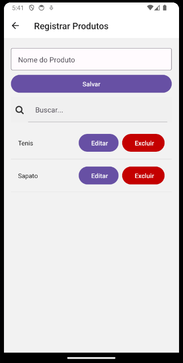
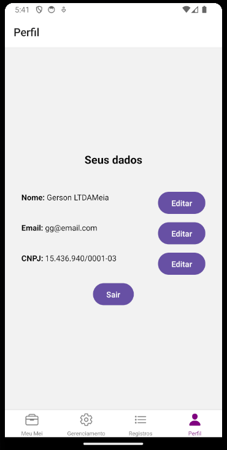

<head>
  <link rel="stylesheet" href="https://cdnjs.cloudflare.com/ajax/libs/font-awesome/6.0.0-beta3/css/all.min.css">
</head>
  

**特色项目** - 第二学年


>**2024年第一学期**

一款面向处于 MEI 税制下创业者的移动应用与网页系统，旨在帮助他们管理营收并保持在法定限额之内。目标是创建提醒，当创业者接近该类别的营收上限时及时通知。此外，系统提供管理支出与收入的方式，生成报告和图表，帮助他们理解自身的财务状况。

### MEI

<button onclick="document.getElementById('meiModal').style.display='block'">
  <i class="fas fa-info-circle" title="点击了解更多关于 MEI 的信息"></i>
</button>

宣传视频（葡语）



**使用技术**：C#、.NET、ASP.NET Core、React.js、React Native、MongoDB、MongoDB Atlas、MongoDB Compass、RESTful API、Swagger、Postman、Visual Studio 2022、VSCode、Rider、Figma、Trello、Git、Github、NUnit、XUnit

- [网站演示](https://meiameipuc.azurewebsites.net/)

- 登录：gg@email.com

- 密码：12345

> 部署在免费的 Azure 服务器上，因此启动可能需要一些时间。

### 网页系统


  
  
  
  
  
  


### 移动应用


  
  
  
  
  
  


您可以在 `GitHub Repository` 中找到更多项目信息。


<!-- 模态框 -->

  

    &times;
    <h2>
      <i class="fas fa-info-circle" ></i>
      什么是 MEI？
      </h2>
      
MEI 是 “Microempreendedor Individual”（个体微型企业家）的缩写。这是巴西为希望将业务正规化的小企业主设立的一种企业类型。MEI 享有简化的税务义务与较少的官僚手续。

  

