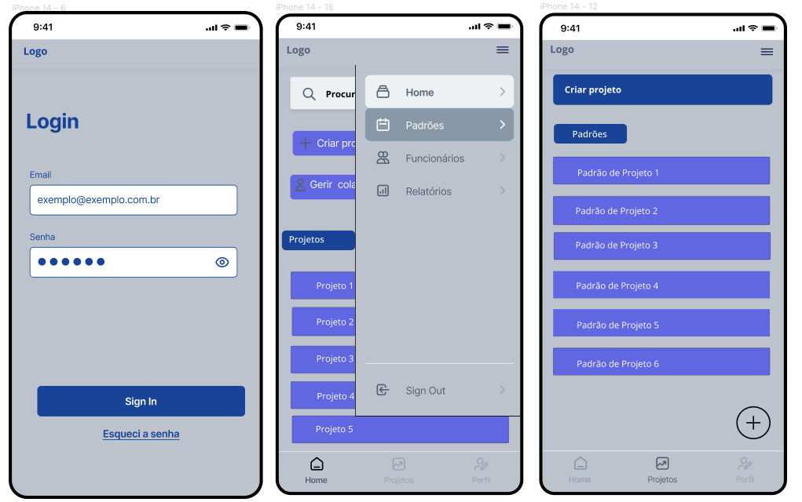

Um aplicativo para tarefas predefinidas agrupadas por projeto, projetado para ser usado por gerentes e funcionários para gerar relatórios sobre o tempo gasto em cada tarefa.

>**Segundo Semestre de 2023**

**Tecnologias**: React Native, Expo, JavaScript, VSCode, SQLite, REST, JSON Server, MySQL

Pré-visualização

  

Você pode encontrar mais informações sobre o projeto no `Repositório GitHub`.
