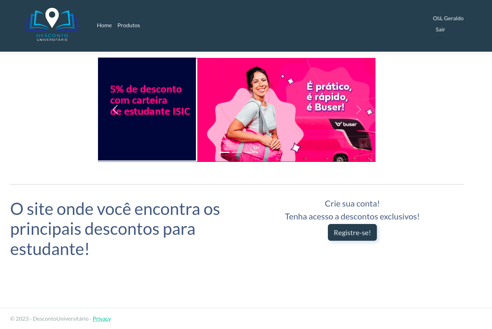

Simplify and shorten the connection between students and discounts/offers provided to them by companies across various sectors.

>**First Semester of 2023**

**Technologies**: HTML, CSS, Bootstrap, Tailwind, Sass, JavaScript, C#, ASP.NET Core (MVC), UML, VSCode, Visual Studio 2022, MySQL, MySQL Workbench, DBeaver, Figma

Preview

  

You can find more information about the project in the `GitHub Repository`.
