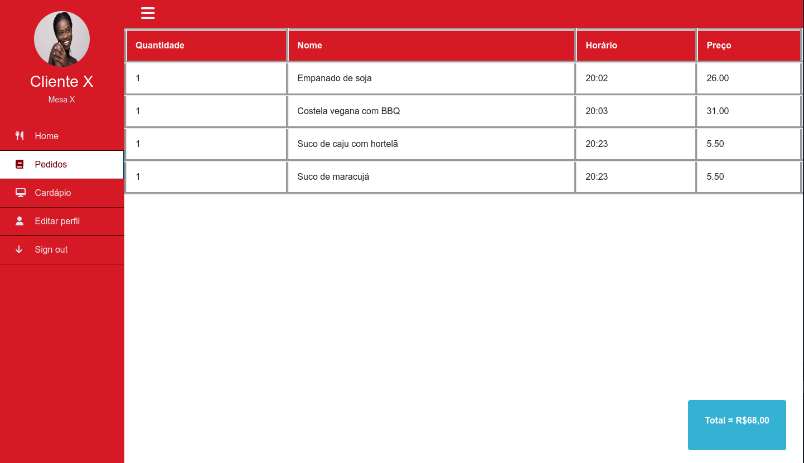

The main objective of this project is to develop a digital menu and self-service system that simplifies daily operations for businesses in the bar and restaurant sector while enhancing customer service. In the future, the system will be able to generate reports on the most requested dishes and drinks, as well as the most profitable items.


**Featured Project** - First Year

>*Second Semester of 2022*

- [Website Demo](https://icei-puc-minas-pmv-ads.github.io/pmv-ads-2022-2-e1-proj-web-t9-bares-restaurantes/)

**Technologies**: HTML, CSS, JavaScript, JSON, MarvelApp, Trello e VSCode

Preview

  

You can find more information about the project in the `GitHub Repository`.
