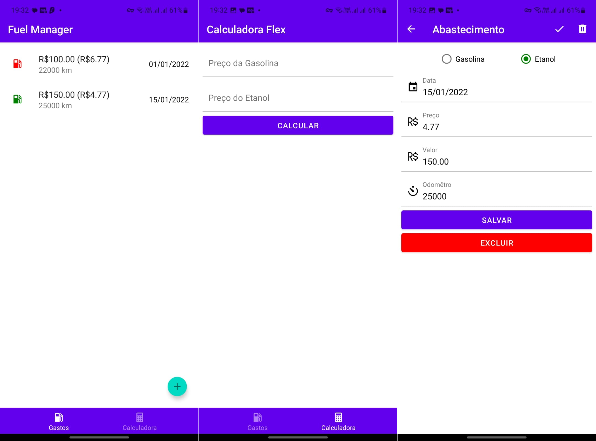

Uma calculadora para determinar qual opção é mais econômica entre gasolina e etanol. Inclui recurso de registros de abastecimento.

**Tecnologias**: React Native, Expo, JavaScript, SQLite, REST, JSON Server

Pré-visualização

  

Você pode encontrar mais informações sobre o projeto no `Repositório GitHub`.
