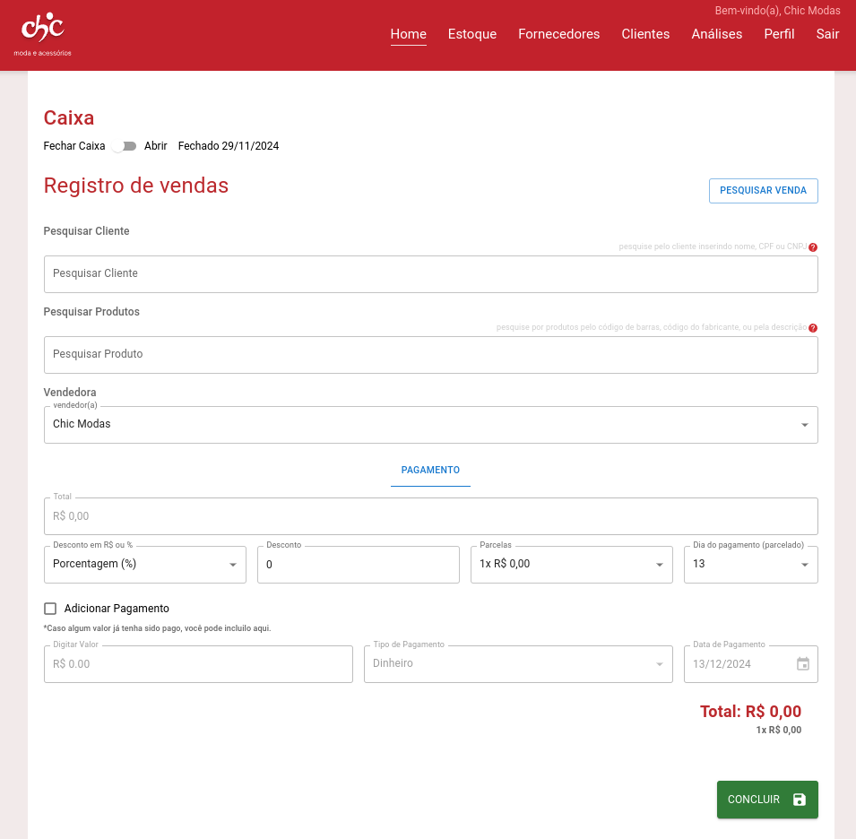


**Projeto de Extensão** - Projeto Final


O projeto desenvolveu um sistema web `ERP`, focado na gestão de vendas, gestão de estoque e gestão de clientes, para uma loja de roupas femininas localizada em Belo Horizonte, MG.

Este projeto foi realizado como o projeto final do curso de Análise e Desenvolvimento de Sistemas da PUC Minas e serviu como requisito para a obtenção do diploma. O projeto foi desenvolvido em parceria com um cliente real. Um contrato de prestação de serviços foi formalizado, e o projeto foi desenvolvido em um ambiente de produção real, tendo sido entregue ao cliente em 6 de dezembro de 2024.

## Funcionalidades

- **Gestão de Estoque**: Permite o cadastro de produtos, fornecedores e categorias.
- **Gestão de Clientes**: Permite o cadastro de clientes, para fins de marketing e vendas.
- **Gestão de Vendas**: Permite o registro de vendas.
- **Gestão Financeira**: Permite o registro de despesas e receitas.
- **Gestão de Usuários**: Permite o cadastro de usuários, com diferentes níveis de acesso.
- **Relatórios**: Permite a geração de relatórios de vendas, estoque, finanças e clientes.

**Tecnologias**: JavaScript, Vite.js, React, Node.js, MySQL, Google Firebase, Google Firestore, Figma, Git, GitHub.

## Pré-visualização


  
  
  
  
  
  
  


*O código-fonte não pode ser disponibilizado devido a restrições contratuais. Dados sensíveis foram borrados nas imagens para preservar a privacidade do contratante e de seus clientes.
