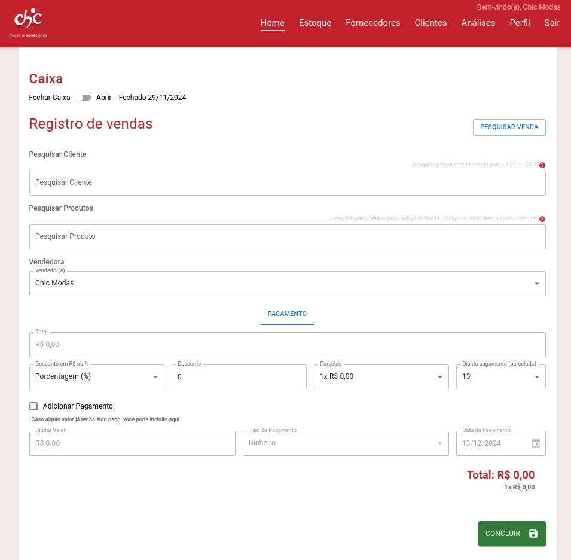
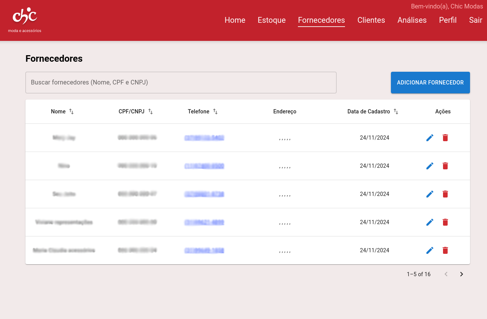
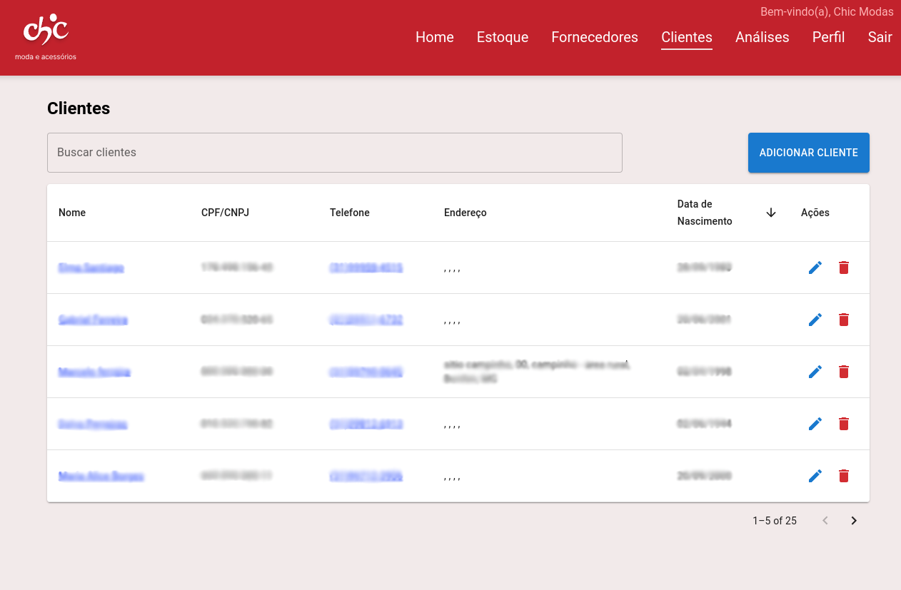
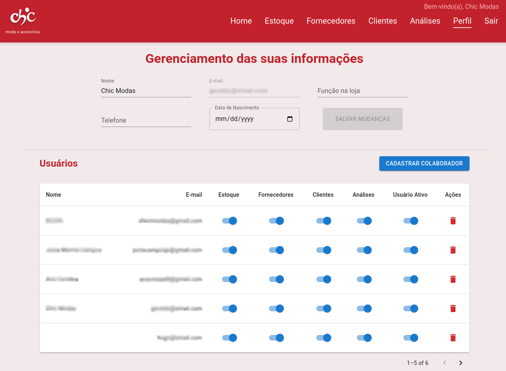
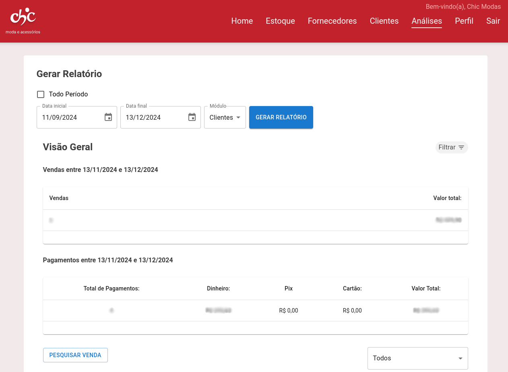
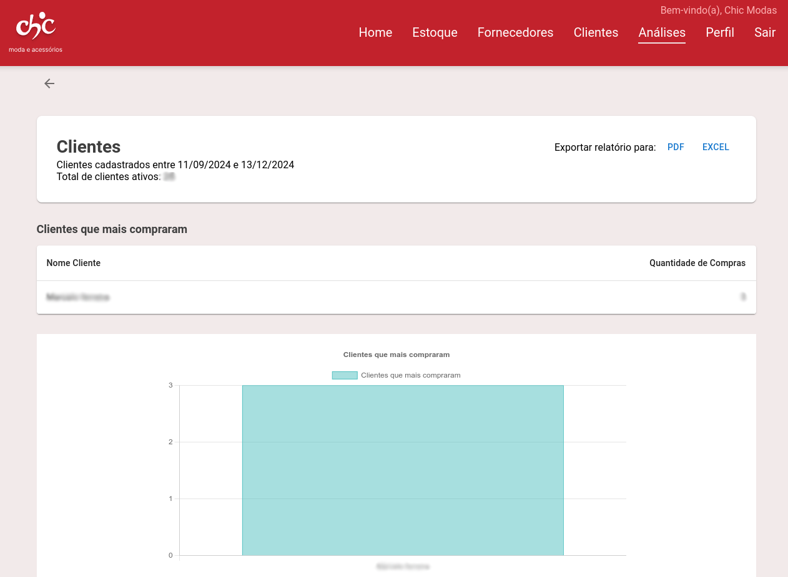
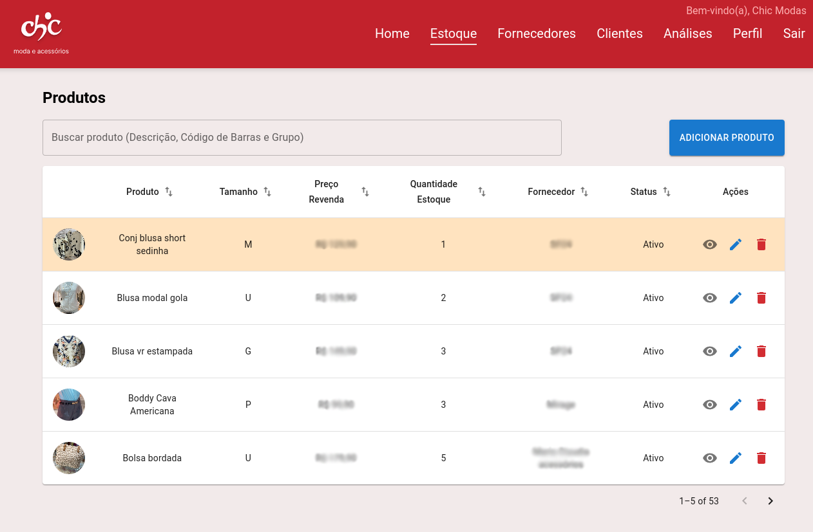


**拓展项目** - 毕业项目


该项目为位于巴西米纳斯吉拉斯州贝洛奥里藏特市的一家女装店开发了一个以销售管理、库存管理和客户管理为核心的 Web `ERP` 系统。

本项目作为米纳斯天主大学系统分析与开发课程的毕业设计，并作为取得文凭的必备条件。项目与一位真实客户合作完成，签订了服务提供合同，并在真实的生产环境中开发，于 2024 年 12 月 6 日交付给客户。

## 功能

- **库存管理**：支持登记产品、供应商和类别。
- **客户管理**：支持登记客户，用于营销和销售目的。
- **销售管理**：支持登记销售记录。
- **财务管理**：支持登记支出与收入。
- **用户管理**：支持登记不同权限级别的用户。
- **报表**：支持生成销售、库存、财务和客户相关的报表。

**技术栈**：JavaScript、Vite.js、React、Node.js、MySQL、Google Firebase、Google Firestore、Figma、Git、GitHub。

## 预览


  
  
  
  
  
  
  


*由于合同限制，源代码无法公开。为保护委托方及其客户的隐私，图片中的敏感信息已做模糊处理。*
